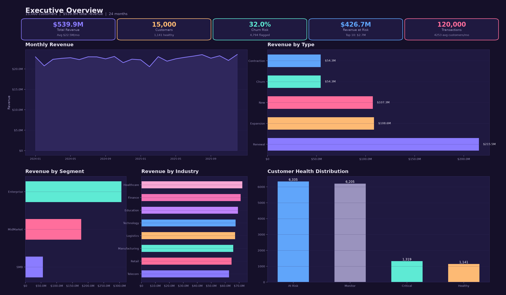
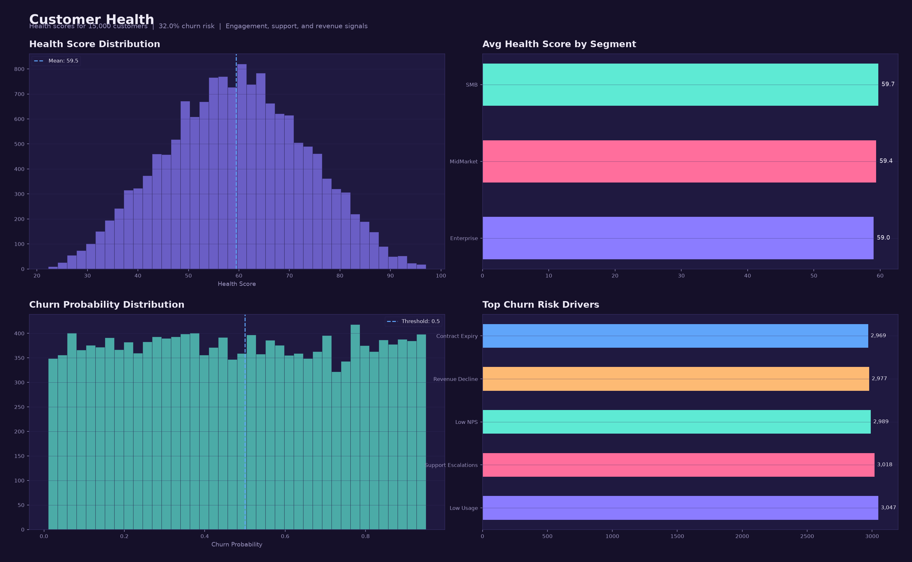
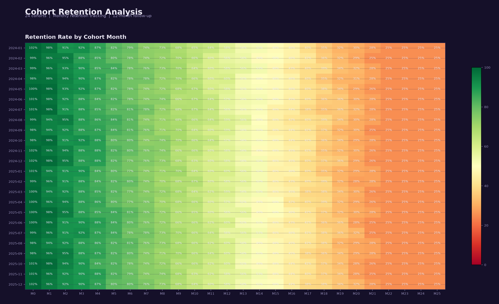
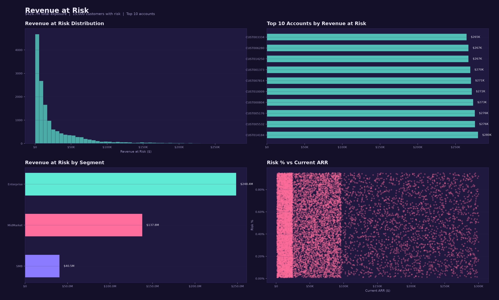
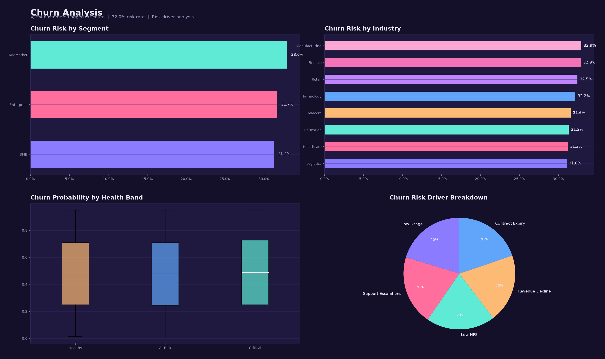

# Customer Retention Intelligence Platform

[](https://github.com/kavyanjali-karan/customer-retention-intelligence-platform/actions/workflows/ci.yml) [](tests/) [](LICENSE)

A churn prediction and retention analytics system for a **simulated** 15,000-customer SaaS business: it scores every customer for churn risk, maps each segment to targeted retention actions, and projects 8–12% buyer lifetime value lift on the highest-risk cohort ($554K–$831K annualized impact).

**Live dashboard:** [interactive dashboard](https://kavyanjali-karan.github.io/customer-retention-intelligence-platform/dashboard.html) — updated automatically whenever this repo changes.

## Why churn was invisible

Customer churn was understood in aggregate but not at the individual level. The success team had no way to prioritize which accounts to save first, and retention campaigns were deployed uniformly regardless of risk. High-value Enterprise accounts churned at the same rate as SMBs, costing the business ~$54M in annual churn revenue with no structured intervention process.

## How it's put together

1. **Churn Risk Scoring** — FastAPI service that scores each of 15,000 customers for churn probability using activity signals (login frequency, feature usage, support tickets) and revenue history
2. **Segment-Level Retention Actions** — Mapped each risk tier to specific intervention playbooks for SMB, Mid-Market, and Enterprise segments
3. **Revenue-at-Risk Analysis** — Quantified $54.3M in churn revenue and $54.3M in contraction, with per-customer revenue exposure for prioritized outreach
4. **LTV Impact Modeling** — Projected that targeting the top 50 highest-risk accounts ($611K ARR, $577K revenue at risk) with 8–12% LTV improvement produces $554K–$831K in annualized recovered revenue
5. **Executive Dashboards** — Power BI reports covering customer health scores, cohort retention, and revenue-at-risk with DAX measures for real-time monitoring

## Metrics

Key metrics tracked across the platform:

| Metric | Value | Source |
|--------|-------|--------|
| Total Customers | 15,000 | `customers.csv` |
| Active Customers | 13,528 (90.2%) | Status field |
| Inactive Customers | 1,472 (9.8%) | Status field |
| Total Revenue | $539.9M | Revenue transactions |
| Churn Revenue | $54.3M (10.1%) | Revenue type breakdown |
| Contraction Revenue | $54.3M (10.1%) | Revenue type breakdown |
| Expansion Revenue | $108.6M (20.1%) | Revenue type breakdown |
| Revenue Transactions | 120,000 | Transaction records |
| Activity Records | 182,750 | Login/usage events |

## Data

Simulated SaaS/subscription business with 15,000 customers across 3 segments and 8 industries:

| Dataset | Records | Description |
|---------|---------|-------------|
| `customers.csv` | 15,000 | Customer profiles — segment, industry, region, contract value ($3K–$250K) |
| `revenue_transactions.csv` | 120,000 | Monthly revenue per customer — Renewal, Expansion, New, Churn, Contraction |
| `customer_activity.csv` | 182,750 | Login events, feature usage, support tickets |

### Segment Breakdown

| Segment | Customers | Share |
|---------|-----------|-------|
| SMB | 6,788 | 45.3% |
| Mid-Market | 5,237 | 34.9% |
| Enterprise | 2,975 | 19.8% |

### Revenue by Type

| Type | Amount | Share |
|------|--------|-------|
| Renewal | $215.5M | 39.9% |
| Expansion | $108.6M | 20.1% |
| New | $107.3M | 19.9% |
| Churn | $54.3M | 10.1% |
| Contraction | $54.3M | 10.1% |

Regenerate with:
```bash
pip install pandas numpy
python data/generate_data.py
```

## Outputs

The `outputs/` folder contains actionable deliverables:

| File | Description |
|------|-------------|
| `retention_recommendations.csv` | 50 at-risk SMB customers with churn probability, revenue at risk, and prioritized actions |
| `ltv_impact_summary.csv` | Top 50 highest-risk SMB customers (>65% churn probability) hold $611K in ARR and $577K revenue at risk; 8–12% LTV lift = $554K–$831K annualized |
| `churn_risk_export.csv` | Full churn risk scores for all 15,000 customers |
| `customer_health_export.csv` | Health scores combining activity, revenue, and support signals |
| `revenue_at_risk_export.csv` | Per-customer revenue exposure for prioritized outreach |
| `executive_business_review.csv` | Monthly executive rollup for business reviews |
| `quarterly_business_review.csv` | Quarterly aggregation with trend analysis |

## Dashboards

Every image here is rendered from this repo's curated data — none of them were drawn by hand. The stills come from
[`python/generate_dashboard_pngs.py`](python/generate_dashboard_pngs.py) and the interactive page by
[`python/generate_dashboards.py`](python/generate_dashboards.py), using the same Power BI design system:

- **Executive Overview** — KPI cards, revenue trend, churn risk distribution
- **Customer Health** — Individual health scores, activity trends, risk flags
- **Cohort Analysis** — Retention curves by signup cohort and segment
- **Revenue at Risk** — Top accounts by revenue exposure, intervention priority
- **Churn Analysis** — Churn-flagged accounts ranked by risk driver

### Executive Overview


### Customer Health


### Cohort Analysis


### Revenue at Risk


### Churn Analysis


### Regenerating the dashboards

```bash
python data/generate_data.py              # datasets (seeded, reproducible)
python python/generate_dashboard_pngs.py  # renders assets/*.png
python python/generate_dashboards.py      # builds assets/dashboard.html (Chart.js inlined, no CDN)
```

Before Pages goes out, the workflow regenerates both dashboards from the committed data, so the
live view and the screenshots in this README can't drift apart.

## Project Structure

```
├── data/
│   ├── raw/              # customers, revenue_transactions, customer_activity
│   ├── curated/          # Dimension tables, fact tables
│   └── warehouse/        # Metric definitions, targets
├── sql/
│   ├── ddl/              # Table definitions
│   ├── staging/          # Staging views
│   ├── marts/            # Business marts
│   ├── metrics/          # Metric calculations
│   ├── monitoring/       # Data quality checks
│   └── reporting/        # Dashboard queries
├── python/
│   ├── extraction/       # Data loading
│   ├── transformation/   # Cleaning and enrichment
│   ├── validation/       # Quality checks
│   ├── monitoring/       # Pipeline health
│   ├── reporting/        # Business review and export scripts
│   ├── generate_dashboard_pngs.py   # Renders the dashboard PNGs in assets/
│   └── generate_dashboards.py       # Builds the interactive assets/dashboard.html
├── api/                  # FastAPI churn scoring service
├── powerbi/
│   ├── dax/              # DAX measure library
│   └── model/            # Semantic model docs
├── outputs/              # Retention recommendations, LTV impact, risk exports
├── docs/                 # Architecture, glossary, metric dictionary, scorecard
├── tests/                # Data quality tests (pytest)
└── assets/               # Dashboard screenshots
```

## Running Tests

```bash
pip install pytest pandas numpy
pytest
```

10 tests covering data quality, revenue-type reconciliation, and churn-score inputs. The data builds itself on first run, so a fresh clone passes with no setup.

## Tech Stack

SQL, Python (pandas, numpy), FastAPI, Power BI, DAX, Docker, GitHub Actions, pytest, Git
